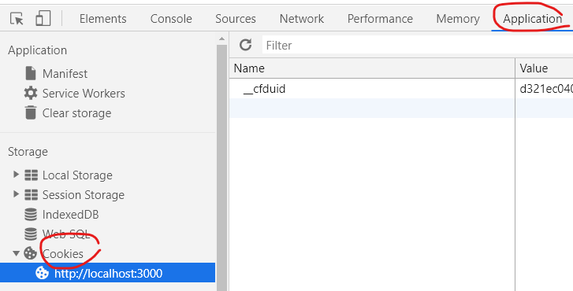

# 쿠키, 세션

Created By: 진아 최
Last Edited: Jan 23, 2020 4:23 PM

### 쿠키 만들기

---

    app.post('/login', (req, res)=>{
        console.log(req.headers.cookie);
    }

### 브라우저에서 생성된 쿠키 확인 (F12)

### 세션 타임아웃 : (default) 마지막 요청으로부터 30분

- **로그인 전과 후의 세션 ID는 달라야 한다. (**보안 조건)
- IP만 같으면(포트 X) 같은 세션ID를 부여

### 세션 보안

- 세션 안에, 로그인할 때의 정보가 있느냐를 검증
(세션이 있느냐 정도의 확인은 보안상에 취약함)