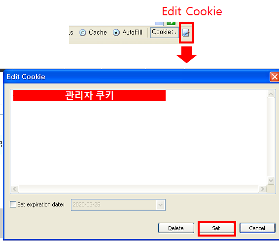

# 세션 및 인증 관리 취약점


## 세션 관리 취약점

---

### 발생원인

- 추측이 가능한 세션 ID

## 실습

---

- Live HTTP Headers 에서 관리자 쿠키(cookie) 값을 확인
- 브라우저 상단에서 쿠키 값 설정 (Edit Cookie)

    

- 쿠키 값만을 사용한 접근

    

(최근) 
쿠키 탈취로 인한 부적절한 서비스 접근을 방지하기 위해 Request Header 내 User-Agent 정보를 활용

```javascript
<div id='img'></div>
<script>document.getElementById("img").innerHTML="
";
</script>
```

## 인증 관리의 취약점

---

- 인증 시 들어오는 데이터는 모두 비신뢰 데이터
- (대응) **서버에 있는 데이터와 입력 데이터와의 비교**
- 권고사항
    1. 모든 페이지에 로그아웃 버튼(또는 링크)가 노출되게 구현